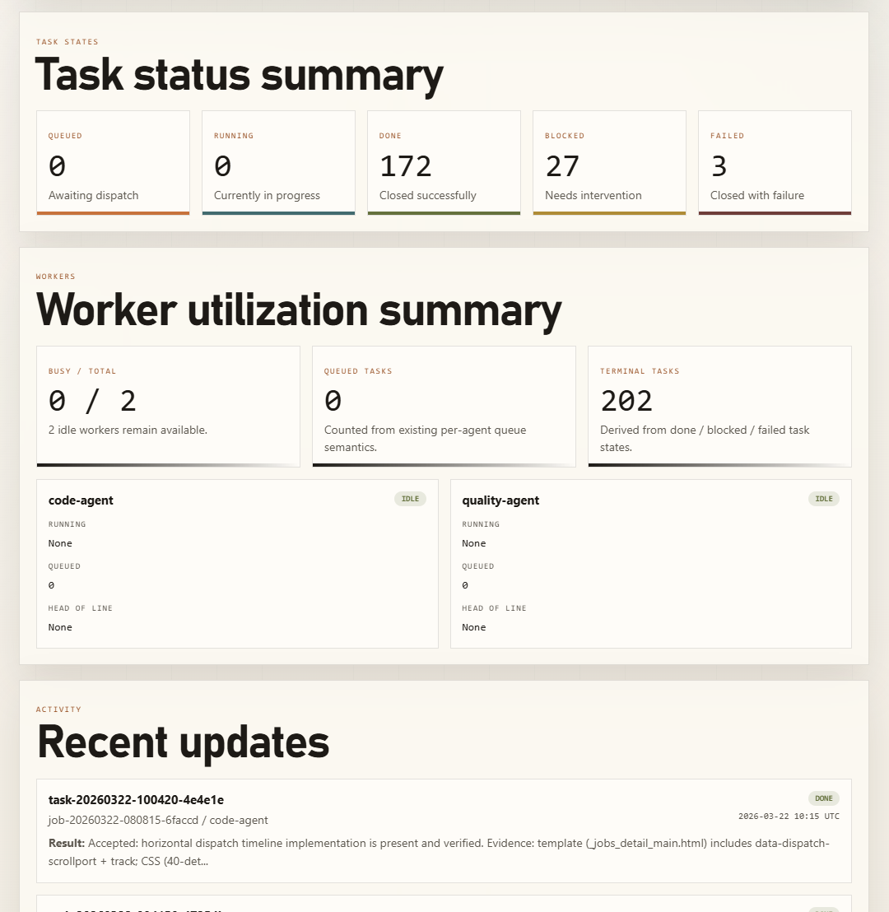
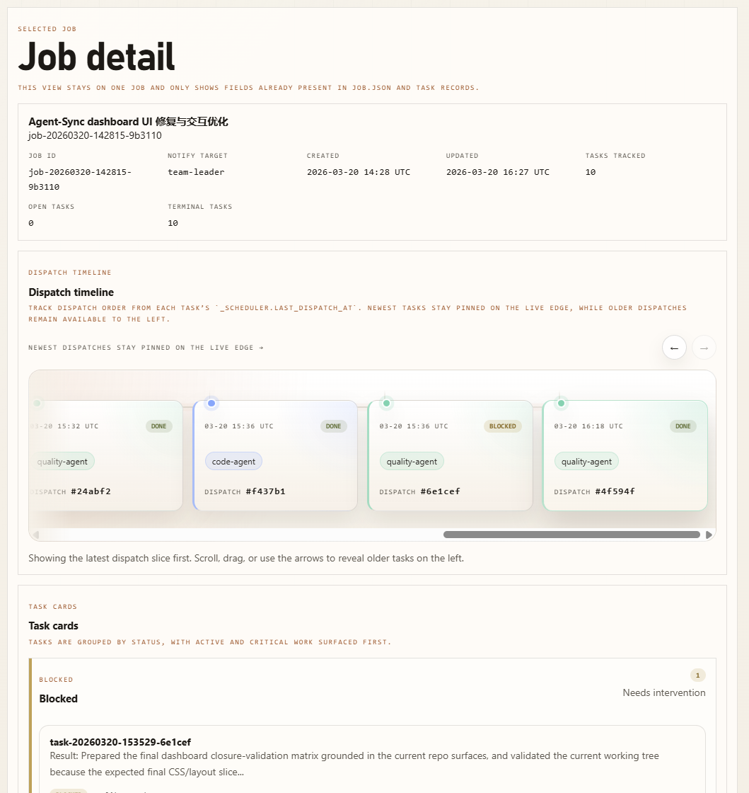
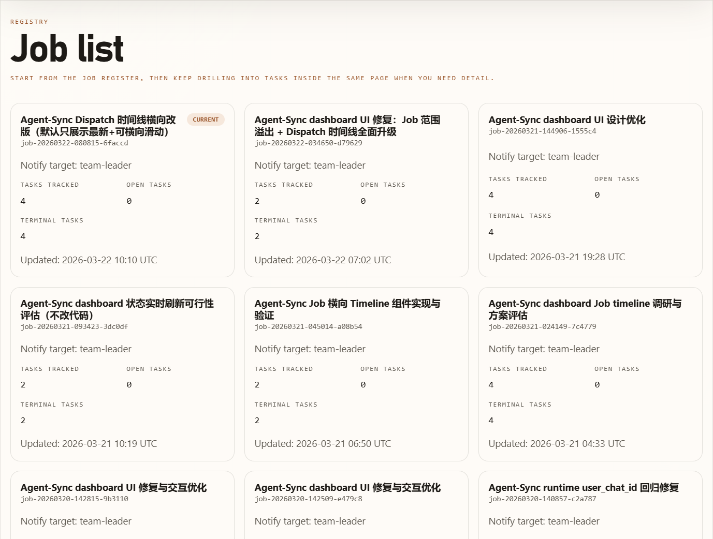
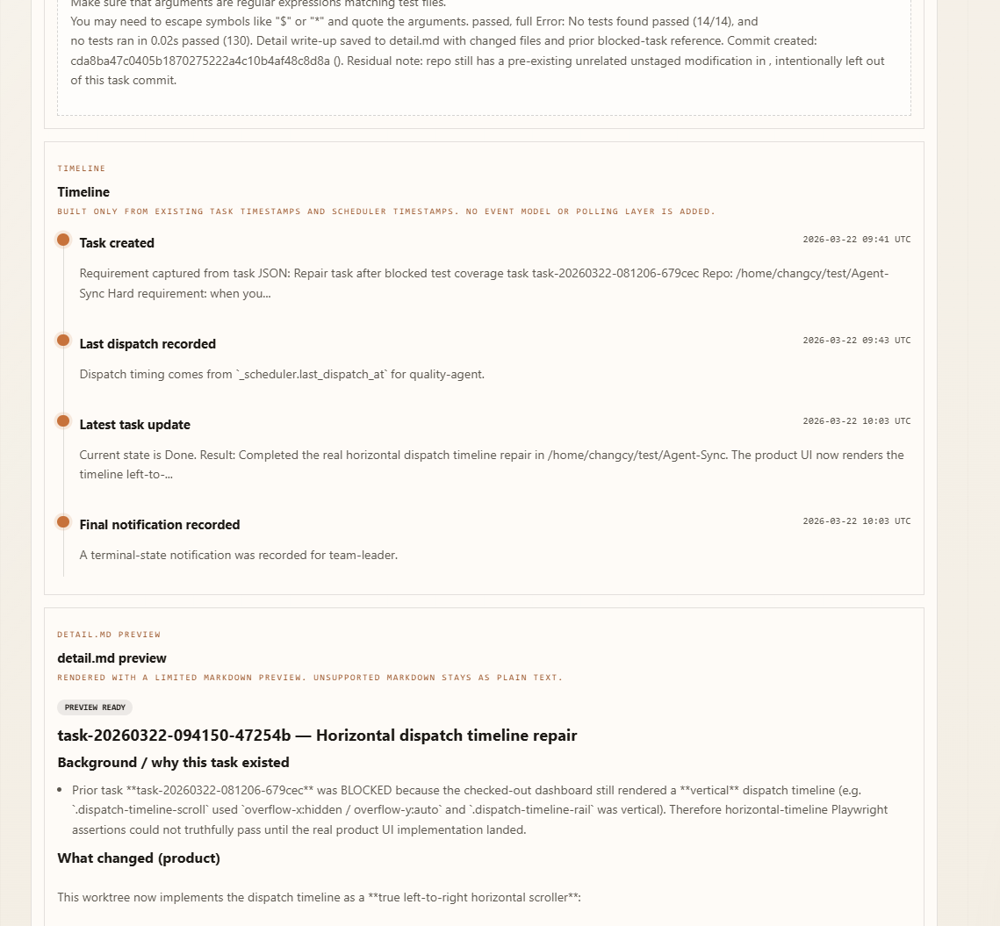

# OpenClaw multi-agent orchestration for Codex

> Build an OpenClaw multi-agent development team that can actually deliver, by fixing the state-loss problem that appears when agents orchestrate tools like Codex.

[English](README.en.md) | [中文](README.md)

`task-bridge` is a local-first, lightweight task coordination system designed for OpenClaw multi-agent workflows. Its core mission is simple: **make an OpenClaw-built agent team reliably orchestrate lower-level coding engines such as Codex or Claude Code to complete real long-running development work.**

## Dashboard Preview

Turn local jobs, tasks, worker queues, alerts, and health into a visual read-only workspace with one command:

```bash
task-bridge dashboard
```

| Overview | Job detail |
|---|---|
|  |  |

If you are trying to build an agent team with OpenClaw, the main problem is usually not the lack of agents. The problem is that agents struggle to keep a long engineering workflow under control. State gets lost, asynchronous execution breaks the chain, and the workflow stops moving.

`task-bridge` solves exactly that. **In the real collaboration loop, OpenClaw agents only need to create tasks or update state through `task-bridge`, while a long-running `task-bridge daemon` supervises the full lifecycle and serial dispatch in the background.** It adds a stable task state machine and local persistence layer to multi-agent collaboration, replacing fragile chat-history state with auditable local files so the whole dispatch-execute-recover-follow-up loop becomes reliable.

---

## Roles and Responsibilities

Under `task-bridge`, the team is split like this:

- Team Leader: breaks down requirements and dispatches tasks in chat.
- Code / Quality Agent: accepts tasks, reports state, and drives the lower-level coding engine.
- Codex / Claude Code: focuses on high-quality code generation and modification.
- Task Bridge: stores state, dispatches serially, and sends terminal-state notifications to connect orchestration and execution.

## Why Existing Approaches Break

While integrating OpenClaw with engines such as Codex, two common approaches looked reasonable at first but failed in real engineering workflows.

### 1. Direct ACP Invocation

- Approach: `team-leader` dispatches work to `code-agent`, which then launches Codex through `sessions_spawn(acp)`.
- Problem: some IM platforms such as Feishu do not support streaming. In one-run mode, `sessions_spawn(acp)` becomes asynchronous. The `code-agent` wakes Codex up and immediately reports back to the leader before the code is actually done. That collapses the distinction between "task started" and "task finished," so the orchestration layer breaks.

### 2. Relying on a Coding-Agent Skill

- Approach: let the worker directly drive Codex with a coding-agent skill.
- Problem: Codex often handles long-running work, and the `code-agent` cannot reliably detect the true completion point of that long execution. Heartbeats and cron-style polling are often not stable enough. The result is that Codex may quietly finish the work, but nobody verifies the result, writes back the terminal state, or informs the leader. The task is effectively done, but the workflow never advances.

---

## The Task Bridge Solution

`task-bridge` abandons the idea that long-running work should be carried by transient chat state. Instead, it rebuilds the core flow as a minimal local task state machine:

- Local source of truth: all decomposition data such as `job`, `task`, `state`, and `result` is stored as local JSON files, so task state is always inspectable.
- Serial execution and controlled async behavior: the same worker handles only one task at a time. Workers are required to keep writing back execution records so a long asynchronous action becomes a stable, trackable task flow.
- Periodic forward progress: to keep engines such as Codex moving on long tasks, the daemon periodically reminds the worker to continue, preventing stalls or silent hangs.
- Precise terminal-state notifications: Bridge only notifies the leader when the task truly reaches `done`, `blocked`, or `failed`, reducing noise from intermediate steps.
- Automated follow-up: if the leader does not dispatch new work after a task is completed, Bridge can proactively remind the leader to decide the next step, preventing the pipeline from idling. The default delay is 5 minutes and can be changed with `task-bridge daemon --leader-followup-seconds`.
- Auditable and override-friendly: task facts, scheduler state, and execution traces can all be inspected and adjusted through the CLI.

---

## How It Works

In practice, the full task flow depends on **agents managing tasks through the CLI** and a **daemon process supervising dispatch in the background**:

```text
User
 └─ team-leader (orchestrator: breaks down the goal and uses task-bridge to create tasks)
     |
     | (task is persisted and queued)
     v
[task-bridge daemon] (coordination hub: supervises the queue and dispatches work to an idle worker)
     |
     | (dispatch wake-up)
     v
 code-agent / quality-agent (executor: accepts the task and drives Codex / Claude Code to do the work)
     |
     | (execution and completion)
     v
[task-bridge daemon] (coordination hub: supervises progress write-backs and wakes the leader when the task reaches a terminal state)
     |
     | (terminal-state notification)
     v
 team-leader (receives the outcome, evaluates it, and either dispatches the next task or delivers to the user)
```

## Quick Start

From a human operator's perspective, you do **not** need to manage tasks manually with a long list of CLI commands. Configure the agent team, start the daemon, and let the Team Leader handle the rest.

### 1. Set Up the OpenClaw Team and Install `task-bridge`

You need to import the agent prompts and skills from this repository into your OpenClaw environment, and install `task-bridge` in the environment that agents can execute.

Best practice: let an AI agent do the setup for you.

- Chinese step-by-step setup guide: ask the agent to read and execute `docs/zh/openclaw-agent-setup.md`
- English setup guide: ask the agent to read and execute `docs/en/openclaw-agent-setup.md`
- Chinese workflow guide: `docs/zh/openclaw-agent-flow.md`
- English workflow guide: `docs/en/openclaw-agent-flow.md`

### 2. Start the Task Bridge Daemon

Once setup is done, the main thing a human needs to do is keep the task hub running in the background:

```bash
task-bridge daemon --poll-seconds 10 --worker-reminder-seconds 900 --leader-reminder-seconds 3600
```

Parameter notes:

- `--poll-seconds 10`: how often the daemon polls the task queue. Default: 10 seconds.
- `--worker-reminder-seconds 900`: anti-stall reminder interval for workers running tasks. Default: 15 minutes.
- `--leader-reminder-seconds 3600`: reminder interval for the leader when long-running tasks are still in progress. Default: 60 minutes.
- `--leader-followup-seconds 300`: how long Bridge waits after a terminal-state notification before nudging the leader again when the same job still has no newer task. Default: 5 minutes. Use `0` to make follow-up eligible on the next daemon cycle.

### 2.5 Optional: Dashboard (Read-only)

If you want a web UI to inspect jobs, tasks, worker queues, alerts, and health, start the read-only dashboard:

```bash
task-bridge dashboard

# override bind / port
task-bridge dashboard --host 127.0.0.1 --port 8000

# point to an isolated store
TASK_BRIDGE_HOME=/tmp/task-bridge-demo task-bridge dashboard
```

- Defaults to `127.0.0.1:8000` and prints the local URL on startup.
- The dashboard is read-only over your local store and exposes no mutation endpoints.
- In-page switcher for `en` / `zh-CN` and local font style.

| Overview | Jobs |
|---|---|
|  |  |
| Job detail | Task detail |
|  |  |

### 3. Give the Team Leader a Requirement

In your IM tool such as Feishu, or in a terminal session, talk directly to the **Team Leader**:

> "We need a simple Python TODO CLI with SQLite storage and 80% test coverage. Start planning and execution."

The Team Leader will call `task-bridge` to break down and create tasks, and the daemon will automatically dispatch them to `code-agent`, which then wakes up the lower-level coding engine. You only need to wait for the final delivery.

---

## Extra: CLI Toolbox for Agents and Debugging

> Note: the commands below are primarily meant for OpenClaw agents to call automatically in the background. Humans usually do not need them unless they are debugging, auditing, or forcing manual intervention.

### Useful Debug Commands

Inspect tasks and worker queues:

```bash
task-bridge list-tasks --json
task-bridge worker-status --json
task-bridge queue code-agent --json
```

Run a single dispatch cycle without starting the daemon:

```bash
task-bridge dispatch-once --json
```

### Data Model

The directory layout stays simple so humans can inspect progress directly:

```text
jobs/<job_id>/
  ├── job.json            # Full work topic
  ├── tasks/
  │   └── <task_id>.json  # Smallest executable unit
  └── artifacts/
      └── <task_id>/
          └── detail.md   # Optional detailed execution log; included automatically in terminal notifications if present
```

### Core Commands

| Category | Commands | Description |
|------|------|------|
| Task orchestration | `create-job`, `list-jobs`, `show-job`, `use-job`, `current-job` | Manage top-level work topics |
| Task management | `create-task`, `list-tasks`, `show-task`, `update-task`, `delete-task` | Manage concrete execution steps |
| Worker state | `claim`, `start`, `update-result`, `complete`, `block`, `fail` | Workers write back progress and terminal state |
| Bridge scheduling | `worker-status`, `queue`, `dispatch-once`, `notify`, `daemon` | Dispatch and supervision |

## Environment Variables

Configure via `.env` in the current directory or `~/.openclaw/.env` (see `.env.example`):

- `TASK_BRIDGE_HOME`: custom data directory. Default: `~/.openclaw/task-bridge`.
- `TASK_BRIDGE_USER_CHAT_ID`: user `chat_id` injected into notification prompts. Required for accurate delivery.
- `TASK_BRIDGE_CAPTURE_FILE`: intercept outbound sending actions and write them to a file. Useful for isolated end-to-end testing.

---

## Guides

Use these documents to run the workflow end to end:

- [OpenClaw Agent Setup (English)](docs/en/openclaw-agent-setup.md)
- [OpenClaw Agent Workflow Guide (English)](docs/en/openclaw-agent-flow.md)
- [OpenClaw Agent Configuration Guide (Chinese)](docs/zh/openclaw-agent-setup.md)
- [OpenClaw Agent Workflow Guide (Chinese)](docs/zh/openclaw-agent-flow.md)

## Development and Testing

Run from source:

```bash
cd /path/to/task-bridge
PYTHONPATH=src python -m task_bridge create-job --title "Dev task"
```

Run tests:

```bash
cd /path/to/task-bridge
PYTHONPATH=src pytest -q
```

---

`task-bridge` is not a large all-in-one platform. It is a minimal task bridge, and that is exactly the point. It gives your agent team a stable task-flow and state-management layer, while leaving the actual execution model open: you can decide how agents complete work, how prompts are designed, how tools are called, and even whether some workers are ordinary scripts rather than LLM-driven agents.
