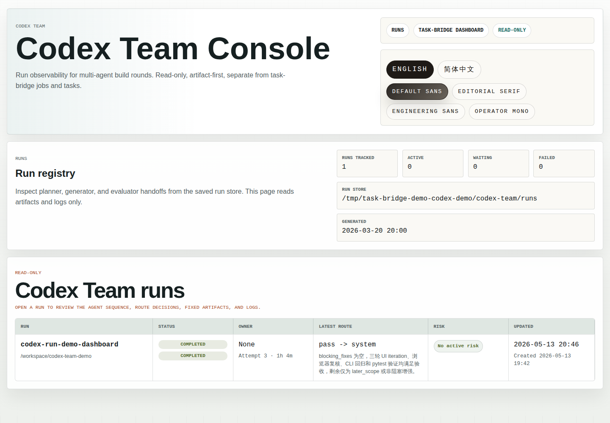
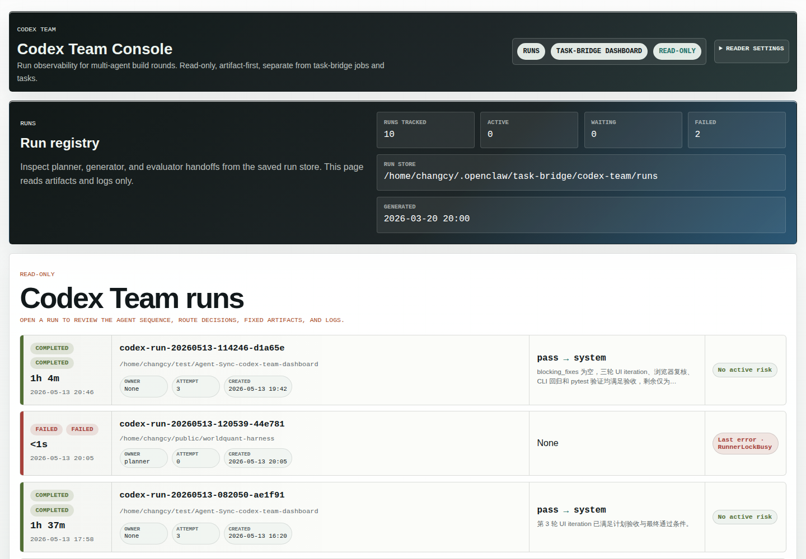
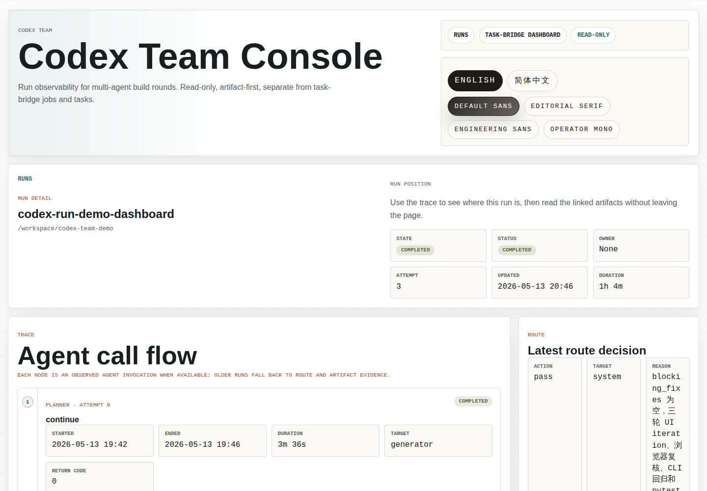
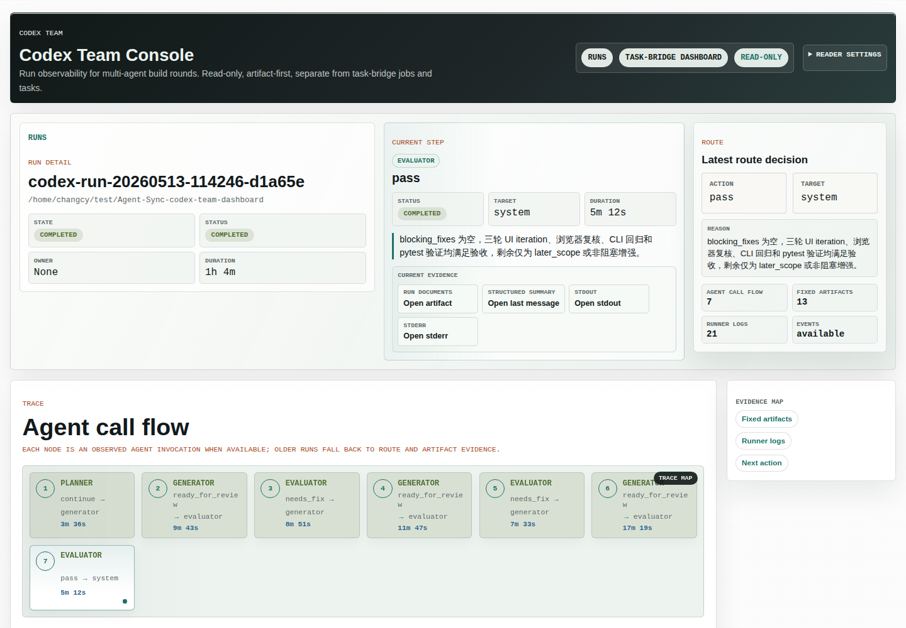
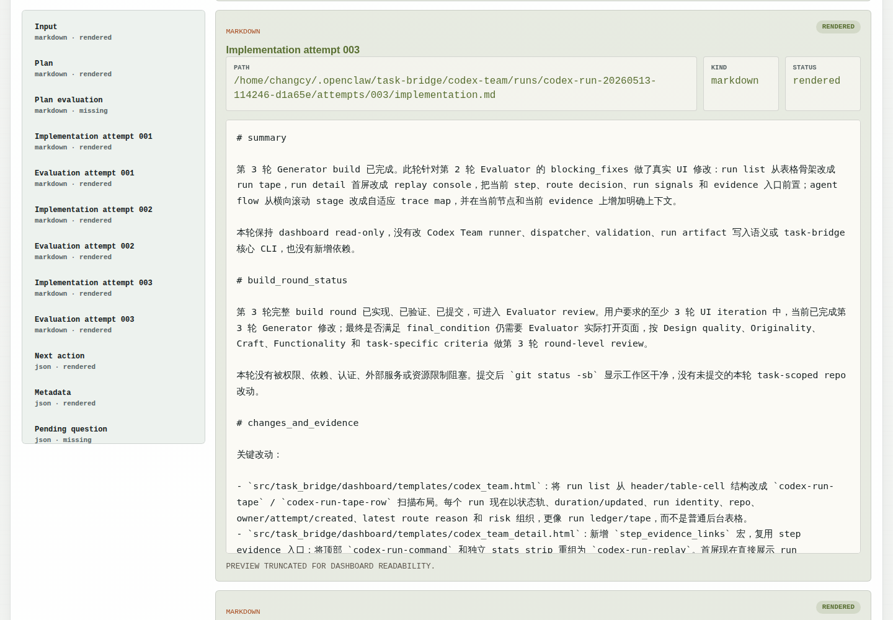
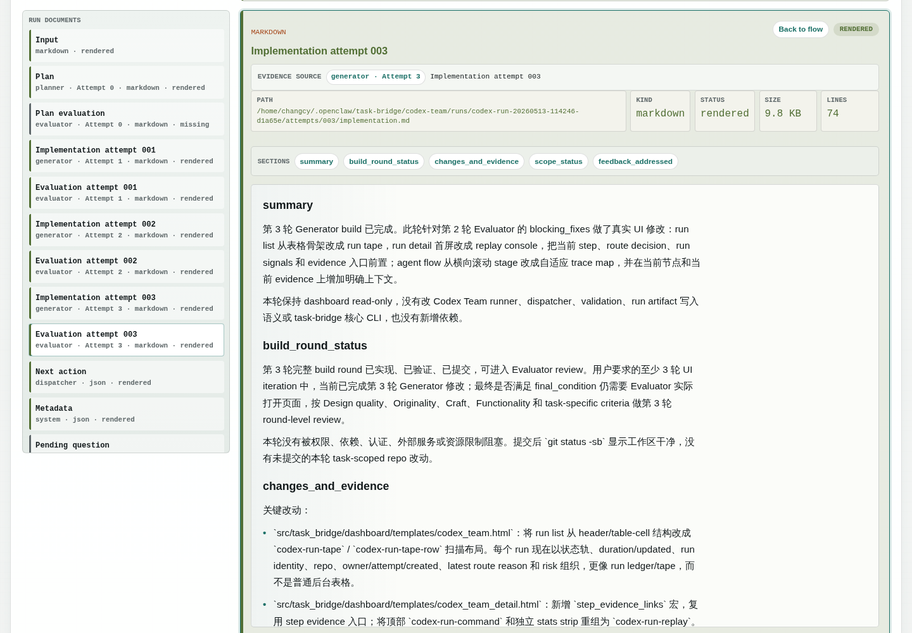
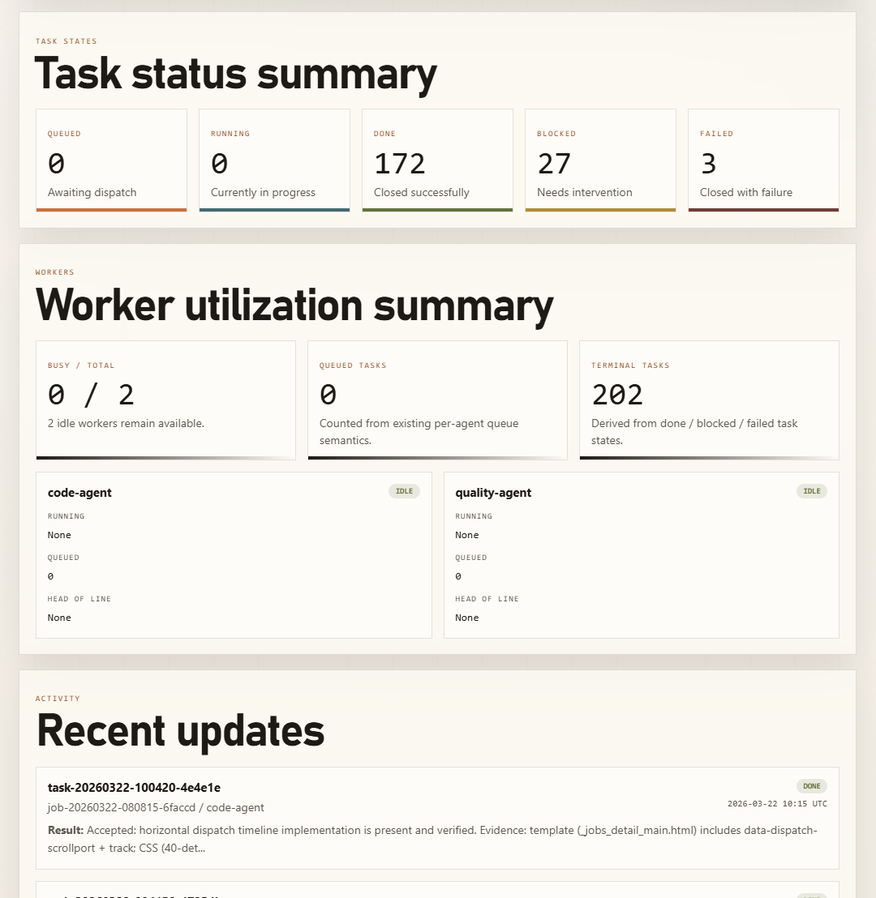
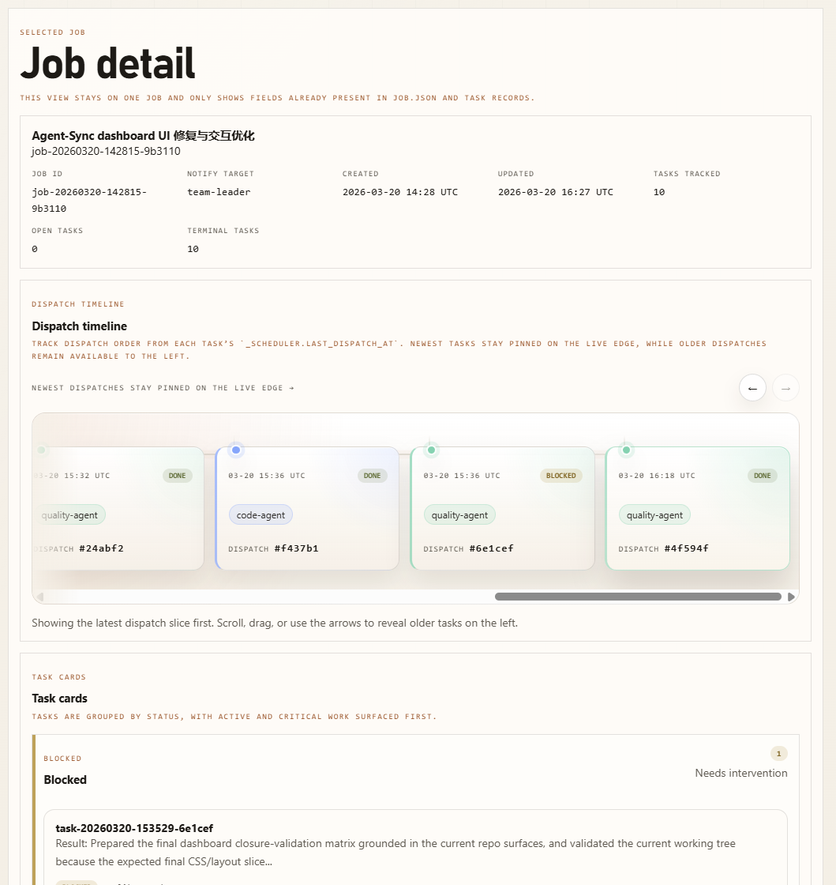
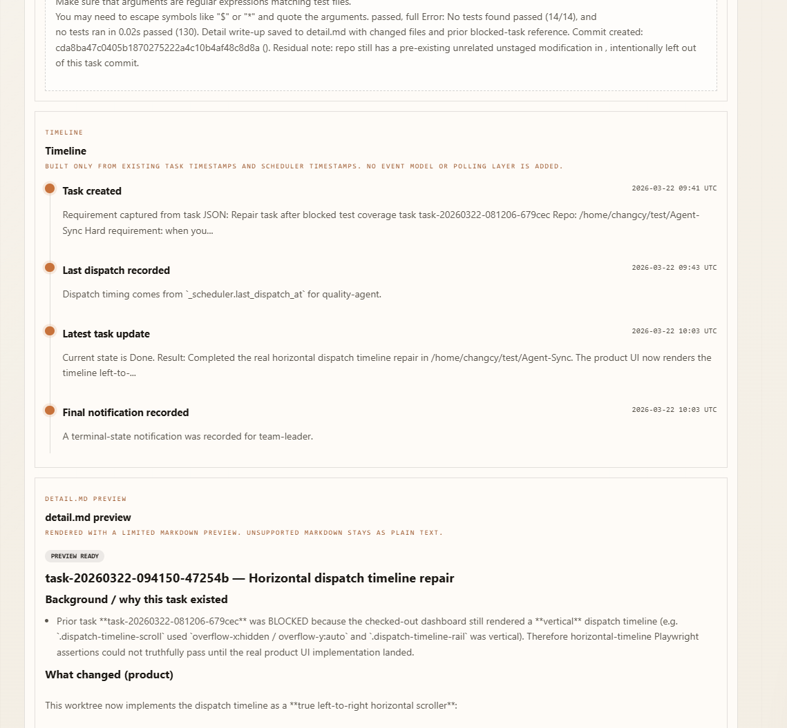
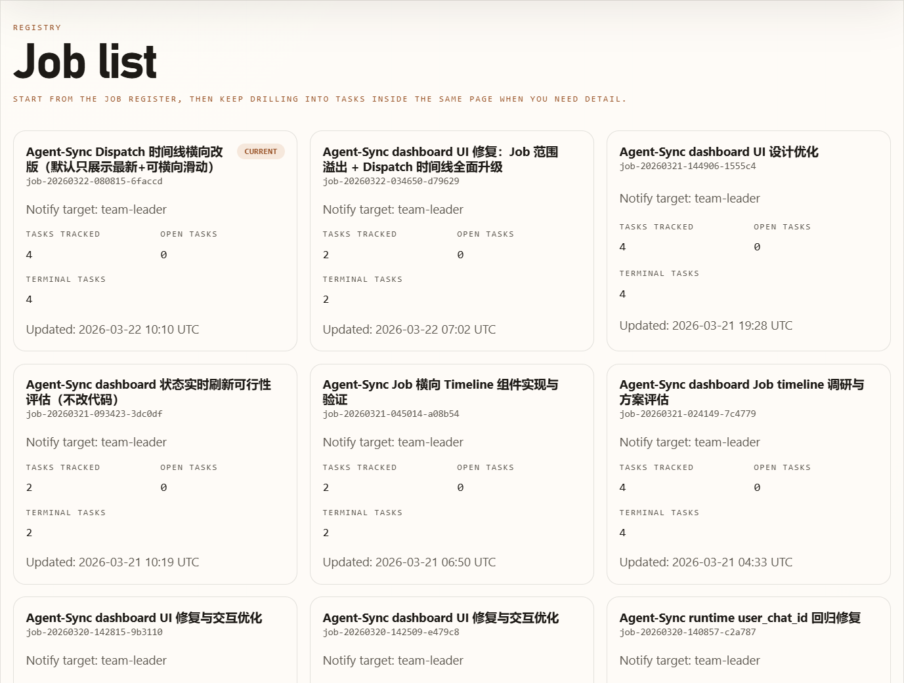

# Codex Team and OpenClaw Multi-Agent Task Orchestration

> Build a Codex / OpenClaw multi-agent development team that can actually deliver, and fix the state loss, evidence loss, and handoff breakage that appear in long-running agent work.

[English](README.en.md) | [中文](README.md)

`task-bridge` is a local-first multi-agent coordination system. It now has two primary layers: an independent **Codex Team harness** that uses Planner / Generator / Evaluator roles for long-running coding tasks, and an OpenClaw task bridge that owns Jobs, Tasks, Worker queues, terminal notifications, and anti-stall scheduling.

---

## Codex Team: Long-Running Development Harness

`task-bridge codex-team` is a Codex harness separate from the OpenClaw job/task flow. It does not turn a large request into a mechanical chain of tiny tickets. Instead, three roles cooperate around one local run home: the Planner turns a high-level request into a testable product and engineering spec, the Generator completes a full build round, and the Evaluator independently reviews the result before passing it or sending focused fixes back.

The design revisits several ideas from Anthropic's [Harness design for long-running application development](https://www.anthropic.com/engineering/harness-design-long-running-apps): clear roles, file-based handoff, an independent evaluator, and feedback loops that make subjective quality reviewable. Codex Team keeps those useful structures, but compresses the implementation into the smallest shape `task-bridge` needs: local files, JSON envelopes, a resumable runner, and a read-only dashboard.

Core flow:

```text
User input
  -> Planner    writes plan.md: goal, scope, acceptance, risks, and boundaries
  -> Generator  completes a full build round and writes implementation.md plus evidence
  -> Evaluator  reviews code, tests, UX, and artifacts, then writes evaluation.md
       | pass        -> completed
       | needs_fix   -> Generator starts another fix round
       | needs_design -> Planner reshapes the plan
       | ask_user    -> paused until the user answers
```

Design principles:

- **Separate judgment from building**: the Generator does not approve its own work. The Evaluator owns the pass/fail decision.
- **File-based handoff**: `input.md`, `plan.md`, `attempts/<n>/implementation.md`, and `attempts/<n>/evaluation.md` are the cross-session source of truth.
- **Lightweight routing**: agents emit a structured action envelope; the dispatcher validates, records, wakes the next owner, pauses, and resumes.
- **Full build rounds**: the Generator keeps moving across one coherent capability boundary instead of paying an external handoff cost for every helper, test fix, or ordinary bug.
- **Replayable observability**: the dashboard connects each agent invocation, state, duration, route decision, artifact, and log into one auditable trace.
- **Reviewable design quality**: for UI work, the Evaluator must critique Design quality, Originality, Craft, and Functionality, so iteration improves the product rather than only checking that code runs.

### Codex Team Quick Start

```bash
# Start a real Codex Team run
task-bridge codex-team start --repo-root "$PWD" --input "Implement a small feature" --json

# Inspect status, logs, and detail
task-bridge codex-team status <run_id> --json
task-bridge codex-team logs <run_id> --tail 20 --json
task-bridge codex-team show <run_id> --json

# Verify the run store and CLI without starting real Codex
TASK_BRIDGE_HOME=/tmp/task-bridge-codex-smoke \
  task-bridge codex-team start --repo-root "$PWD" --input "smoke test" --no-run --json
```

### Codex Team Dashboard

```bash
task-bridge dashboard
# Open /codex-team to inspect run lists and details
```

The new Codex Team dashboard is separate from the OpenClaw Task Bridge dashboard. It behaves more like a run replay console: the list page shows run state, the detail page puts agent call flow, current route, and duration first, and the artifact reader carries the large Markdown and log content.

| First separated run list | Iterated run list |
|---|---|
|  |  |
| The first version already separated Codex Team runs from Task Bridge jobs and tasks. | The latest version uses a clearer run tape that emphasizes state, duration, owner, attempt, and route signals. |

| First run detail | Iterated run detail |
|---|---|
|  |  |
| The call flow is visible, but route, current step, and evidence entry points are scattered. | The first viewport now shows current step, route decision, agent call flow, duration, and evidence map before deeper detail. |

| First artifact reader | Iterated artifact reader |
|---|---|
|  |  |
| Large artifacts are mostly plain previews, which makes long-document review harder. | The latest reader adds an artifact sidebar, section chips, metadata, and rendered Markdown for long artifacts. |

---

## Task Bridge Dashboard Preview (OpenClaw Orchestration)

Turn local Jobs, Tasks, Worker Queue, Alerts, and Health into a visual dashboard with one command:

```bash
task-bridge dashboard
```

As a human operator or Team Leader, you can use the dashboard to monitor the whole team in real time. Below are examples of the overview page and the job detail page:

| Dashboard overview | Dashboard job detail |
|---|---|
|  |  |
| **Bird's-eye view**: inspect task-state distribution, agent queue activity, and system health. | **Execution focus**: drill into one job to review the dispatch timeline, task breakdown, and current blockers. |

| Task detail | Bilingual support |
|---|---|
|  |  |
| **Execution evidence**: inspect the event timeline, latest result summary, and attached Markdown execution details in one place. | **Full visibility**: quickly tell which jobs are still moving and which ones have converged. Supports English/Chinese UI and local font switching. |

---

## Why Existing Approaches Break

When you try to assemble an agent team with OpenClaw, the hardest problem is usually not the lack of agents. The real problem is that **agents struggle to keep long-running development work under control**.

When building an OpenClaw multi-agent engineering team, people usually try one of two mainstream approaches. In real engineering workflows, both can cause catastrophic orchestration breakage:

### 1. Treating "Execution Started" as "Execution Finished"

- **Approach**: the Team Leader breaks work down and asks another Agent to start an external long-running session or asynchronous execution channel.
- **Why it breaks**: on IM platforms such as Feishu that do not support long-lived streaming, external execution channels usually become asynchronous. The Agent sends the start command, immediately assumes its own work is finished, and reports "task completed" to the Leader. Once "task started" is treated as "task finished," the Leader can move into review or dispatch the next step far too early, and the multi-agent workflow collapses right at the start.

### 2. Making Workers Relay Instead of Own Tasks

- **Approach**: the Worker receives a task, but instead of executing it directly, it hands the task to another execution layer.
- **Why it breaks**: real engineering tasks often require tens of minutes of context retrieval, code generation, and iterative correction. If the worker only hands the task off instead of owning status write-back, the orchestration layer cannot reliably tell whether the task is not started, running, done, blocked, or failed. No one verifies the result, no one writes back the terminal state, and no one notifies the Leader. Execution may be done, while orchestration is permanently stalled.

---

## The Task Bridge Solution

`task-bridge` abandons the idea that long-running work should be carried by transient chat state, and rebuilds the flow as a minimal local task state machine:

- **Local persisted source of truth**: instead of relying on fragile chat history, every Job, Task, and State is stored locally as JSON.
- **Serial execution with controlled async behavior**: one Worker handles only one task at a time, and it must keep writing back execution records so asynchronous work becomes a stable, traceable task flow.
- **Skill-first direct execution**: when a Worker receives a task, it first checks the skills available in the current session. If a matching skill exists, it uses that skill first. If not, it reads the repository, runs commands, and records evidence directly.
- **Periodic anti-stall progress nudges**: the daemon periodically reminds Workers to keep moving, preventing silent hangs.
- **Precise terminal notifications with automated follow-up**: the Leader is only woken when a task truly reaches `done`, `blocked`, or `failed`, and unattended terminal tasks can trigger an automatic follow-up reminder so the pipeline does not stall.

---

## A Complete Agent Team

The system introduces a specialized agent team that covers the full software-delivery lifecycle. Under `task-bridge`, responsibilities stay clear:

- **Team Leader (Coordinator)**: handles user-facing decisions, task creation, evidence recovery, and final handoff. It does not directly own design, implementation, testing, or release execution.
- **Planning Agent (Planner)**: owns requirement clarification, solution shaping, sprint contracts, acceptance criteria, and verification requirements.
- **Code Agent (Engineering Worker)**: owns implementation-level design, code reading, root-cause investigation, implementation, fixes, refactors, tests, and commits.
- **Quality Agent (Evaluator)**: owns plan evaluation, implementation evaluation, independent review, QA, risk grading, and bounded local fixes when they fit the quality task.
- **Release Agent (Delivery Worker)**: owns release preparation, PR/deploy/post-deploy checks, rollback criteria, and documentation sync.
- **Task Bridge (Task Hub)**: the invisible backbone that persists state, dispatches serially, and sends terminal-state notifications.

### Operating Model

```text
User --> [Team Leader] --planning--> [Planning Agent]
             |                           |
      (create / break down Jobs & Tasks) |
             |                           |
             v                           v
     ================ [Task Bridge Daemon] ================
     | (core hub: monitors the queue in the background and |
     |  dispatches work to idle Workers)                  |
     ======================================================
             |                           |
        (dispatch wake-up)          (dispatch wake-up)
             v                           v
       [Code Agent] <---collab---> [Quality Agent] ---> [Release Agent]
        (implementation)           (testing and review)   (docs and release)
             |                           |
             +------(write-backs and terminal notices)----+
```

---

## Quick Start (Human View)

As a human user, you do not need to manage tasks manually through a long list of CLI commands. Configure the environment, start the daemon, and then just talk to the Team Leader.

### 1. Configure and Install

You need to load the Agent prompts from this repository into OpenClaw and install `task-bridge` into the environment your agents can execute. This project owns agent definitions, task orchestration, state transitions, evidence collection, and handoff. It does not configure or validate the lower-level execution environment:

```bash
# Run the minimum install from the repository root
python -m pip install -e .
```

*(Note: if you change `pyproject.toml` or the console entry point, run this command again.)*

`planning-agent`, `code-agent`, `quality-agent`, and `release-agent` are direct execution agents. When a Worker receives a task, it first checks the skills available in the current session. If a matching skill exists, it uses that skill first. If no skill fits, it reads the repository, runs commands, and records evidence directly.

**Best practice: let AI configure it for you**

Hand the setup documents to OpenClaw `default-agent` or Claude Code:

- Chinese setup guide: `docs/zh/openclaw-agent-setup.md`
- English setup guide: `docs/en/openclaw-agent-setup.md`

### 2. Start the Task Bridge Daemon (Background Supervisor)

Once setup is done, keep the task hub running in the background:

```bash
task-bridge daemon --poll-seconds 10 --worker-reminder-seconds 900 --leader-reminder-seconds 3600
```

The daemon writes `~/.openclaw/task-bridge/daemon.pid`, `daemon_heartbeat.json`, and `daemon_errors.jsonl` automatically. It also holds a local lock so one data directory cannot accidentally run multiple daemons.

**Parameter notes:**

- `--poll-seconds 10`: queue polling interval. Default: 10 seconds.
- `--worker-reminder-seconds 900`: anti-stall reminder interval for Workers. Default: 15 minutes. If progress is not updated in time, the Worker is nudged to continue.
- `--leader-reminder-seconds 3600`: reminder interval for the Leader on long-running work. Default: 60 minutes. This prevents the Leader from losing awareness of execution status.
- `--leader-followup 300`: terminal-task follow-up window. Default: 5 minutes. Use `0` to disable it. If a terminal result arrives and no new task is created for too long, Bridge merges the situation into one reminder and nudges the Leader for a next-step decision.

Inspect daemon status:

```bash
task-bridge daemon-status --json
```

**Persistent run (`nohup`)**:

```bash
mkdir -p .task-bridge
nohup task-bridge daemon \
  --poll-seconds 60 \
  --worker-reminder-seconds 2700 \
  --leader-reminder-seconds 7200 \
  --leader-followup 1800 \
  > .task-bridge/daemon.log 2>&1 &
```

*(To stop it, prefer `task-bridge daemon-status --json` to read the real pid, then run `kill <pid>`.)*

### 3. Launch the Dashboard (Read-only, Optional)

```bash
# Default bind: 127.0.0.1:8000
task-bridge dashboard

# Or specify host and port
task-bridge dashboard --host 127.0.0.1 --port 8000
```

*Note: the dashboard only reads local data and exposes no write operations. It is suitable for auditing, blocker inspection, and daily checks.*

### 4. Give the Team Leader a Requirement

In your IM tool (such as Feishu) or in a terminal session, talk directly to the **Team Leader**:

> "We need to build a Python CLI tool with user authentication and 80% test coverage. Let the Planning Agent produce the plan first, then let the Code Agent start implementation."

From there, the Team Leader will break the work down automatically, and the daemon will wake each agent in sequence until the work is delivered.

---

## Extra Material: CLI Toolbox (For Agents / Debugging)

> **Note**: the commands below are primarily meant for agents to call in the background, such as when they write back progress. Human operators usually do not need them except for debugging or forced intervention.

### Common Debug Commands

```bash
# Inspect queue and status
task-bridge list-tasks --json
task-bridge worker-status --json
task-bridge queue code-agent --json
task-bridge daemon-status --json

# Run one dispatch cycle without starting the daemon
task-bridge dispatch-once --json

# Mark historical terminal tasks without sending real agent messages
task-bridge notify-backfill --mark-only --json

# Inspect Codex Team harness commands
task-bridge codex-team -h
```

### Local Data Model

The task structure is explicit and easy to inspect under `~/.openclaw/task-bridge/`:

```text
current_job
daemon.pid              # Current daemon process info; removed on clean daemon exit
daemon_heartbeat.json   # Latest daemon heartbeat, pid, and phase_errors
daemon_errors.jsonl     # Daemon phase errors and daemon_state corruption records
daemon_state.json       # Persistent reminder / notify / heartbeat state
jobs/<job_id>/
  |- job.json            # Full work topic
  |- tasks/
  |  \- <task_id>.json   # Smallest executable unit
  \- artifacts/
     \- <task_id>/
        \- detail.md     # Optional full execution details; included automatically in terminal notifications
codex-team/
  \- runs/
     \- <run_id>/
        |- metadata.json
        |- events.jsonl
        |- next_action.json
        |- input.md
        |- plan.md
        |- plan_evaluation.md
        \- attempts/
           \- 001/
              |- implementation.md
              \- evaluation.md
```

### Core Commands

| Category | Commands | Description |
|------|------|------|
| **Task orchestration** | `create-job`, `list-jobs`, `show-job`, `use-job`, `current-job` | Manage high-level work topics (used by the Leader) |
| **Task management** | `create-task`, `list-tasks`, `show-task`, `update-task`, `delete-task` | Manage concrete execution steps |
| **Worker state** | `claim`, `start`, `update-result`, `complete`, `block`, `fail` | Workers write back progress and terminal states (used by multiple agents) |
| **Bridge scheduling** | `worker-status`, `queue`, `dispatch-once`, `notify`, `notify-backfill`, `daemon`, `daemon-status` | Dispatching, notification backfill, supervision, and daemon health checks |
| **Codex Team harness** | `codex-team start/status/show/logs/answer/resume/cancel` | Create, inspect, resume, and cancel isolated Codex Team runs |

### Codex Team Harness (Experimental)

`codex-team` is a harness subsystem separate from the existing job/task terminal-notification flow. It reuses `TASK_BRIDGE_HOME`, the CLI, atomic JSON writes, and the test infrastructure, but run states do not directly map to existing `task-bridge` task states such as `done`, `blocked`, or `failed`.

Common commands:

```bash
task-bridge codex-team start --repo-root /path/to/repo --input "Implement a small feature" --json
task-bridge codex-team status <run_id> --json
task-bridge codex-team show <run_id> --json
task-bridge codex-team logs <run_id> --tail 20 --json
task-bridge codex-team answer <run_id> --text "Limit scope to the CLI path" --json
task-bridge codex-team resume <run_id> --json
task-bridge codex-team cancel <run_id> --reason "User cancelled" --json
```

`resume` is only for retryable runner-level failures on failed runs, such as Codex auth interruption, runner timeout, runner lock, or a missing final envelope. It first tries `codex exec resume <thread_id>` from the failed stdout log; when no thread id is available, it falls back to rerunning the current owner. Paused runs still use `answer`, and protocol or fixed-artifact failures are not resumable by default.

To verify the run store and CLI without starting real Codex, use:

```bash
TASK_BRIDGE_HOME=/tmp/task-bridge-codex-smoke \
  task-bridge codex-team start --repo-root "$PWD" --input "smoke test" --no-run --json
```

### Dispatch Reliability

- Before dispatch, Bridge checks whether the worker already has a `running` task, is still waiting for claim, is in cooldown, or has been blocked by real dispatch failures.
- A real `/reset` or send failure no longer kills the daemon. Bridge records `last_dispatch_error`, increments `dispatch_failure_count`, and retries after the backoff window.
- After repeated real failures, the task enters `dispatch_blocked` so the same worker session is not restarted forever. Editing a queued task's `requirement` or `assigned_agent` clears those failure fields.
- When the OpenClaw process budget is full, Bridge returns `process_budget` and briefly defers dispatch. This is not a real failure, does not count toward `dispatch_blocked`, and avoids touching a worker session before `/reset`.
- `notify_updates()` only processes the current job by default. Historical terminal tasks require an explicit `notify-backfill --mark-only` or `notify-backfill --summary`, so old completed tasks do not flood `team-leader`.
- `TASK_BRIDGE_CAPTURE_FILE` mode bypasses real OpenClaw delivery and process-budget checks. It writes `/reset`, dispatch, and notify messages to JSONL for safe end-to-end tests.

---

## Environment Variables and Advanced Configuration

The system automatically reads variables from the current working directory `.env` or `~/.openclaw/.env`:

- `TASK_BRIDGE_USER_CHAT_ID`: the user `chat_id` injected into notification prompts. The notification chain depends on it.

The variables below must be injected explicitly through your shell or command prefix:

- `TASK_BRIDGE_HOME`: custom data directory. Default: `~/.openclaw/task-bridge`.
- `TASK_BRIDGE_CAPTURE_FILE`: intercept outbound sends and write them to a file. Useful for isolated end-to-end tests.
- `TASK_BRIDGE_OPENCLAW_MAX_GLOBAL`: maximum global `openclaw agent` processes. Default: `2`; use `0` for unlimited.
- `TASK_BRIDGE_OPENCLAW_MAX_PER_AGENT`: maximum `openclaw agent` processes for one agent. Default: `1`; use `0` for unlimited.
- `TASK_BRIDGE_OPENCLAW_RESET_TIMEOUT_SECONDS`: maximum `/reset` command wait time in seconds. Default: `60`.
- `TASK_BRIDGE_DASHBOARD_SSH_TARGET`: override the SSH target shown in dashboard launch guidance without changing the actual bind address.

---

## Reference Guides

To fit this workflow cleanly into your environment, see:

- [OpenClaw Agent Setup (Chinese)](docs/zh/openclaw-agent-setup.md)
- [OpenClaw Agent Workflow Guide (Chinese)](docs/zh/openclaw-agent-flow.md)
- [OpenClaw Agent Setup (English)](docs/en/openclaw-agent-setup.md)
- [OpenClaw Agent Workflow Guide (English)](docs/en/openclaw-agent-flow.md)

Design and implementation references:

- [Agent runtime design](specs/agent-runtime-design.md)
- [Codex Team collaboration design](specs/codex-team-agent-collaboration-design.zh-CN.md)
- [Codex Team milestone development plan](specs/codex-team-milestone-development-plan.zh-CN.md)
- [Dashboard MVP read-only spec](specs/dashboard-mvp-read-only-spec.md)
- [Worker skill usage principles](specs/gstack-agent-skill-allocation.zh-CN.md)
- [OpenClaw agent definition notes](specs/openclaw-agent-definition.zh-CN.md)
- [Agent definition directory](agents/)

---

### Development and Testing Guide

```bash
# 1. Run from source without relying on PATH
PYTHONPATH=src python -m task_bridge create-job --title "Dev task"

# 2. Run Python tests
python -m pip install -e .[test] pytest
python -m pytest -q

# 3. Run Dashboard Playwright tests
npm install
npm run playwright:install
npm run test:playwright
```

> **Task Bridge philosophy**: this is not an all-in-one platform. It is a minimal task bridge. Its real value is that it keeps your agent team from going out of sync and makes AI collaboration actually run end to end. How you design prompts, and how you plug in traditional script workers, remains fully open to you.
