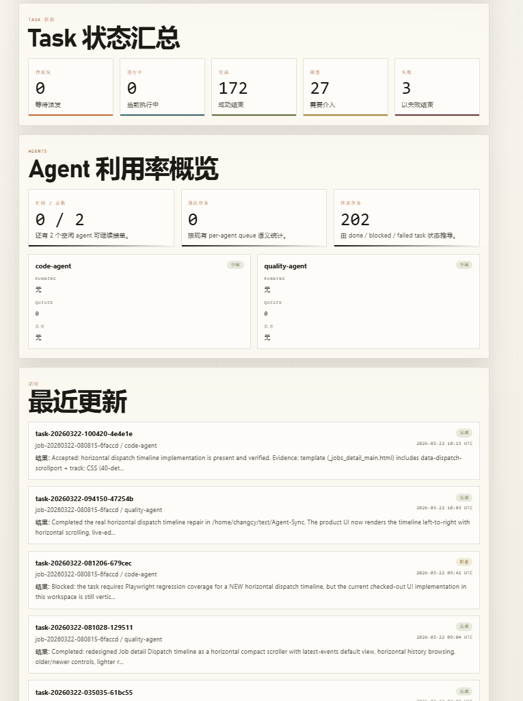
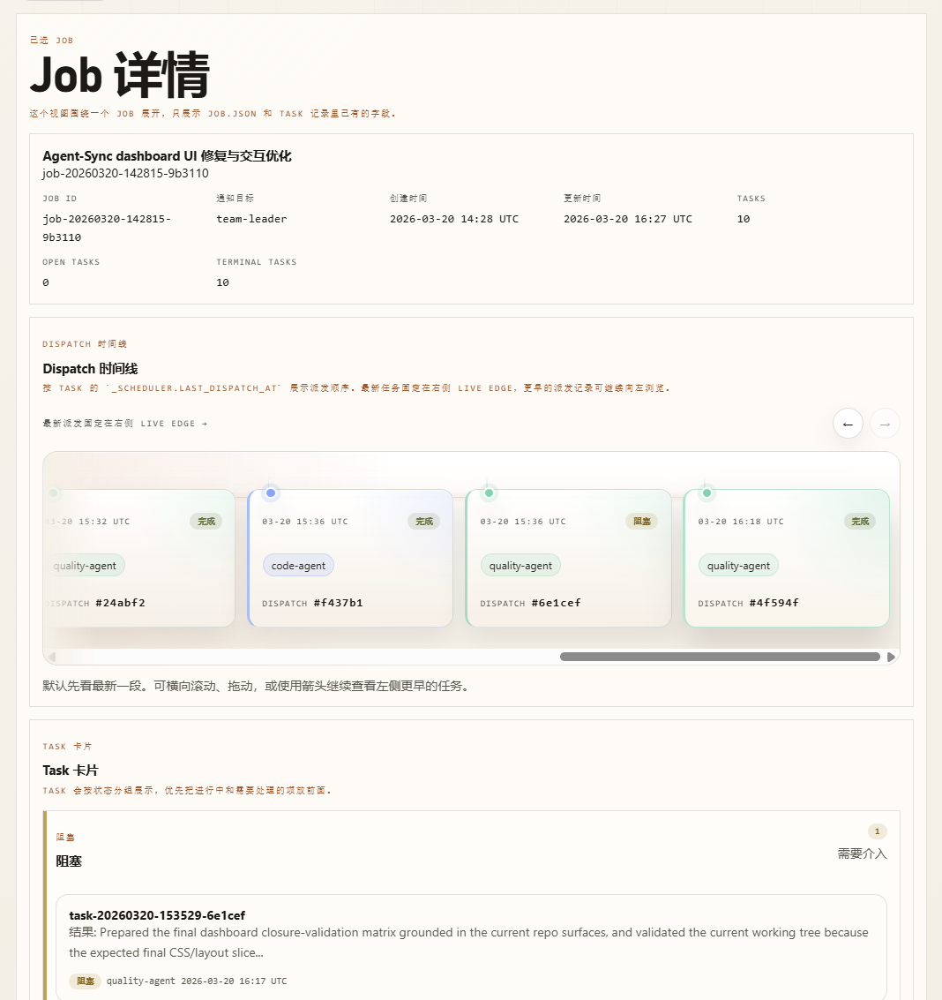
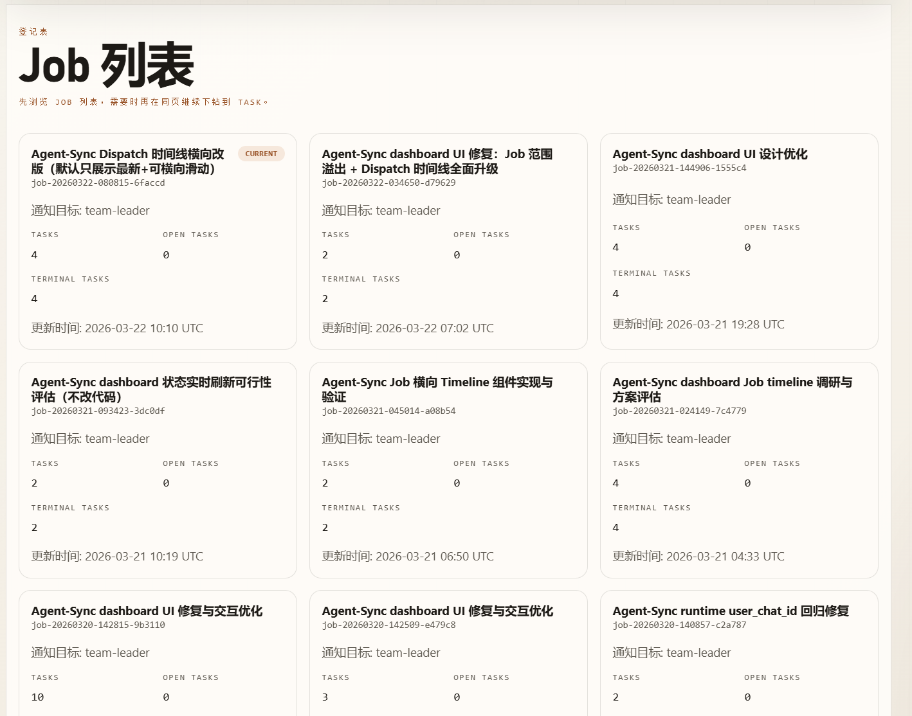
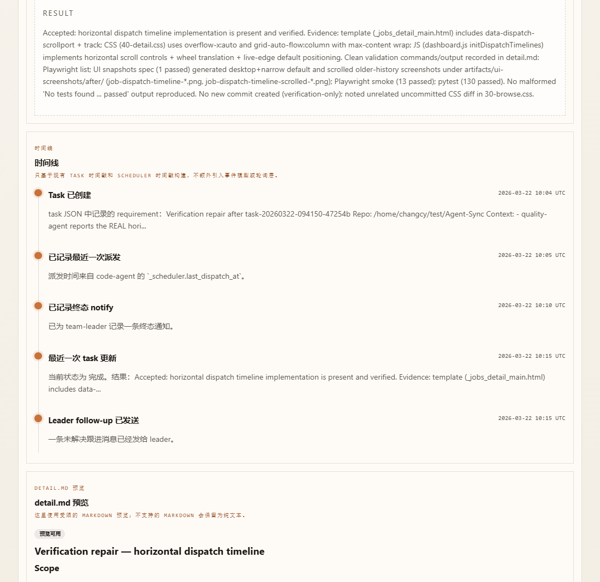

# task-bridge

> 构建真正能交付的 OpenClaw 多 Agent 开发团队，解决由 Agent 驱动 Codex 等工具协作时的状态丢失问题。

[中文](README.md) | [English](README.en.md)

`task-bridge` 是一个本地优先、专为 OpenClaw 多 Agent 协作设计的轻量任务协作系统。**它的核心使命是：让 OpenClaw 构建的多 Agent 协作团队，能够稳定地指挥底层开发引擎（如 Codex 或 Claude Code）去完成实际的长流程开发工作。**

## Dashboard 预览（只读）

用一条命令把本地 job / tasks / worker queue / alerts / health 变成可视化页面：

```bash
task-bridge dashboard
```

| 总览 | Job 详情 |
|---|---|
|  |  |

如果你正在尝试用 OpenClaw 组建 Agent 团队，你可能会发现一个核心痛点：问题往往不在于有没有 Agent，而在于 Agent 无法稳定地把控一个长流程的开发任务，极易因为状态丢失或异步执行而导致工作流断裂。

`task-bridge` 解决的正是这个问题。**在实际的协作链路中，OpenClaw 的各个 Agent 只需要使用 `task-bridge` 建立任务或更新状态，而不再负责交互，由后台常驻的 `task-bridge daemon` 进程负责执行全生命周期的任务监督和串行分发。** 它为多 Agent 协作补充了一层稳定的任务状态机与本地持久化能力，用可追溯的本地文件取代脆弱的聊天记录状态，让“派发-执行-回收-跟进”的开发闭环变得绝对可靠。

---

## 角色与分工

在 `task-bridge` 的编排下，团队职责如下：

- Team Leader (指挥官)：专注需求拆解，在聊天中派发任务。
- Code / Quality Agent (执行者)：专注接单、汇报状态，并驱动底层模型执行具体工作。
- Codex / Claude Code (底层引擎)：专注高质量的代码生成与修改。
- Task Bridge (任务中枢)：负责存储状态、串行派发、终态通知，将指挥与执行对接起来。

## 为什么现有的方案行不通？

在将 OpenClaw 接入 Codex 等引擎的过程中，我尝试过两种主流方案，但在真实的工程场景下都不太可行：

### 1. 直接通过 ACP 链路调用
- 做法：team-leader 分发任务给 code-agent，后者再通过 sessions_spawn(acp) 启动 Codex。
- 问题：由于部分 IM（如飞书）不支持 Stream，在 one-run 模式下 sessions_spawn(acp) 是异步的。code-agent 唤醒 Codex 后，还没等代码写完，就立刻回头向 Leader 汇报“任务已完成”。这导致编排层的“任务已启动”和“任务已完成”被混淆，工作流直接断裂。

### 2. 依赖 coding-agent skill 驱动
- 做法：让 Worker 使用 coding-agent skill 直接驱动 Codex 编码。
- 问题：Codex 处理的往往是长程开发任务，而 code-agent 很难稳定追踪这种超长执行的最终完成节点（依赖 heartbeat 或 cron 常常不稳定）。结果就是：Codex 其实已经默默把活干完了，但 code-agent 并不知道。于是没人去验证结果、回写终态，更没人去通知 Leader，整个任务卡死在“其实做完了，但编排流程没有向前走”的状态。

---

## Task Bridge 的解决方案

`task-bridge` 放弃了用“瞬时聊天状态”承载长程任务的做法，将核心链路重构成一个极简的本地任务状态机：

- 本地落盘的事实源：抛弃聊天记录，所有的拆解结构（job, task, state, result）全部以 JSON 格式落在本地目录中。任务处于什么阶段随时可查。
- 串行执行与异步转可控：同一 Worker 同时只执行一个任务。要求 Worker 必须持续回写执行记录，把异步的长时间动作转化为可追踪的稳定任务流。
- 周期性推进：为了让 Codex 等底层引擎稳定执行超长任务，Daemon 会在执行期间定期通知 Worker 推进任务，防止执行挂起或假死。
- 精准的终态通知：只有任务真正进入 done / blocked / failed 终态时，Bridge 才会通知 Leader 推进下一步，减少中间过程的噪音打扰。
- 自动化 Follow-up：任务完结后如果 Leader 迟迟不布置新任务（默认 5 分钟内），Bridge 会主动提醒 Leader 确认下一步，防止自动化流水线停转。
- 可审计与干预：任务事实、调度状态、执行痕迹，皆可通过命令行直接查看和手动修改。

---

## 运行机制

在实际使用过程中，整个任务流运转依赖于 **Agent 通过 CLI 工具管理任务** 与 **Daemon 守护进程持续监督派发** 的完美配合：

```text
User
 └─ team-leader (指挥官：拆解目标，使用 task-bridge 建立任务)
     │
     │ (任务持久化入队)
     ↓
[task-bridge daemon] (核心中枢：负责在后台监督队列，将任务分发给空闲的 Worker)
     │
     │ (分发唤醒)
     ↓
 code-agent / quality-agent (执行者：接单，并指挥 Codex / Claude Code 等底层引擎编写代码)
     │
     │ (执行过程与结束)
     ↓
[task-bridge daemon] (核心中枢：监督 Worker 回写进度，在任务达到终态时，主动唤醒 Leader)
     │
     │ (终态通知)
     ↓
 team-leader (收到终态通知，评估成果，继续派发新任务或向 User 交付)
```

## 快速开始 (人类视角)

对于人类用户来说，你**不需要**手动敲击繁琐的命令行来管理任务。你只需要配置好 Agent 团队，并启动后台 Daemon 即可，剩下的都交给 Team Leader。

### 1. 配置 OpenClaw 团队与安装

你需要将本仓库提供的 Agent Prompt 和 Skill 配置到你的 OpenClaw 环境中，并安装 `task-bridge` 到 Agent 可执行的环境。

**💡 最佳实践：让 AI 帮你配置**
你不必手动敲命令！只需将配置文档直接丢给 OpenClaw 的 `default-agent` 或 Claude Code，让它们代劳即可：
- **中文保姆级教程**：请让 Agent 阅读并执行 `docs/zh/openclaw-agent-setup.md`
- **English Setup Guide**：Ask your Agent to read and execute `docs/en/openclaw-agent-setup.md`

### 2. 启动 Task Bridge Daemon

配置完成后，人类唯一需要做的事情就是让任务中枢在后台跑起来：

```bash
task-bridge daemon --poll-seconds 10 --worker-reminder-seconds 900 --leader-reminder-seconds 3600
```

**参数说明：**
- `--poll-seconds 10`: Daemon 轮询任务队列的间隔时间（默认 10 秒）。
- `--worker-reminder-seconds 900`: Worker 执行任务的防挂起提醒间隔（默认 15 分钟）。若超时未更新进度，Daemon 会提醒 Worker 推进。
- `--leader-reminder-seconds 3600`: Leader 关注运行中任务的提醒间隔（默认 60 分钟）。如果有正在执行的长程任务，Daemon 会按此间隔定期提醒 Leader 获取最新进度，防止 Leader 长时间失去对任务执行状态的感知。

如果你希望关闭终端后仍然持续运行，可以使用 `nohup`：

```bash
mkdir -p .task-bridge
nohup task-bridge daemon \
  --poll-seconds 60 \
  --worker-reminder-seconds 900 \
  --leader-reminder-seconds 7200 \
  > .task-bridge/daemon.log 2>&1 &
echo $! > .task-bridge/daemon.pid
```

- 查看日志：`tail -f .task-bridge/daemon.log`
- 查看进程：`ps -fp "$(cat .task-bridge/daemon.pid)"`
- 停止 Daemon：`kill "$(cat .task-bridge/daemon.pid)"`
- 若需要自定义数据目录，可在命令前加环境变量，例如：`TASK_BRIDGE_HOME=/tmp/task-bridge-demo nohup task-bridge daemon ...`

### 2.5 可视化 Dashboard（只读，可选）

如果你想用网页集中查看当前 job / tasks / worker queue / alerts / health，可以启动只读 dashboard：

```bash
task-bridge dashboard

# 或指定监听地址与端口
task-bridge dashboard --host 127.0.0.1 --port 8000

# 查看另一个隔离数据目录
TASK_BRIDGE_HOME=/tmp/task-bridge-demo task-bridge dashboard
```

- 默认监听 `127.0.0.1:8000`，启动后会输出本机访问地址。
- Dashboard 只读取本地数据，不提供任何写操作，适合审计、定位卡点与回归检查。
- 页面内支持 `en` / `zh-CN` 与本地字体风格切换。

| 总览 | Job 列表 |
|---|---|
|  |  |
| Job 详情 | Task 详情 |
|  |  |

### 3. 给 Team Leader 下发需求

在你的 IM（如飞书）或终端中，直接与 **Team Leader** 对话：

> "我们要做一个简单的 TODO List 的 Python CLI，用 SQLite 存储，覆盖率要达到 80%，开始安排吧。"

接下来，Team Leader 会自动调用 `task-bridge` 拆解并创建任务，Daemon 会自动分配给 `code-agent` 唤醒底层引擎编写代码。你只需要喝杯咖啡，等待 Leader 的最终交付汇报。

---

## 补充材料：CLI 工具箱 (面向 Agent / 调试)

> **注意**：以下命令和结构主要是供 OpenClaw Agent 在后台自动调用的（如 `code-agent` 使用 `task-bridge update-result` 汇报进度），人类一般不需要手动执行，除非用于 Debug、审计或强制干预。

### 常用调试命令

查看当前任务与 Worker 队列：

```bash
task-bridge list-tasks --json
task-bridge worker-status --json
task-bridge queue code-agent --json
```

单次派发测试（不启动 Daemon 的情况下）：

```bash
task-bridge dispatch-once --json
```

### 数据模型

简单的目录结构，方便随时人工审查进展：

```text
jobs/<job_id>/
  ├── job.json            # 完整工作主题
  ├── tasks/
  │   └── <task_id>.json  # 最小执行单元
  └── artifacts/
      └── <task_id>/
          └── detail.md   # (可选) 完整的执行细节。若存在，终态通知时将自动附带。
```

### 核心命令清单

| 类别 | 命令 | 说明 |
|------|------|------|
| 任务编排 | `create-job`, `list-jobs`, `show-job`, `use-job`, `current-job` | 管理宏观工作主题 |
| 任务管理 | `create-task`, `list-tasks`, `show-task`, `update-task`, `delete-task` | 管理具体执行步骤 |
| Worker 状态 | `claim`, `start`, `update-result`, `complete`, `block`, `fail` | Worker 回写进度与终态 |
| Bridge 调度 | `worker-status`, `queue`, `dispatch-once`, `notify`, `daemon` | 派发与守护机制 |

## 环境变量

可通过当前目录的 `.env` 或 `~/.openclaw/.env` 配置（参考 `.env.example`）：

- `TASK_BRIDGE_HOME`：自定义数据目录（默认 `~/.openclaw/task-bridge`）。
- `TASK_BRIDGE_USER_CHAT_ID`：注入通知 Prompt 的用户 `chat_id`（必填，用于准确推送）。
- `TASK_BRIDGE_CAPTURE_FILE`：拦截发送动作并写入文件，适合做隔离的 E2E 测试。

---

## 配置指南

要将这套工作流真正跑起来，请参考以下文档：

- [OpenClaw Agent 配置指南 (中文)](docs/zh/openclaw-agent-setup.md)
- [OpenClaw Agent 工作流说明 (中文)](docs/zh/openclaw-agent-flow.md)
- [OpenClaw Agent Setup (English)](docs/en/openclaw-agent-setup.md)
- [OpenClaw Agent Workflow Guide (English)](docs/en/openclaw-agent-flow.md)

## 开发与测试

直接运行源码：
```bash
cd /path/to/task-bridge
PYTHONPATH=src python -m task_bridge create-job --title "Dev task"
```

运行单元测试：
```bash
cd /path/to/task-bridge
PYTHONPATH=src pytest -q
```

---

`task-bridge` 不是一个大而全的平台，它是一个极简的任务桥梁。这正是它的价值所在：让你的 Agent 团队不再失联，真正能跑通落地。它提供了一个稳定可靠的任务流转与状态管理系统，至于具体的 Agent 如何完成任务、如何设计 Prompt、怎样调用工具（甚至是接入非大模型的普通脚本 Worker），完全由用户自行设计与扩展。
