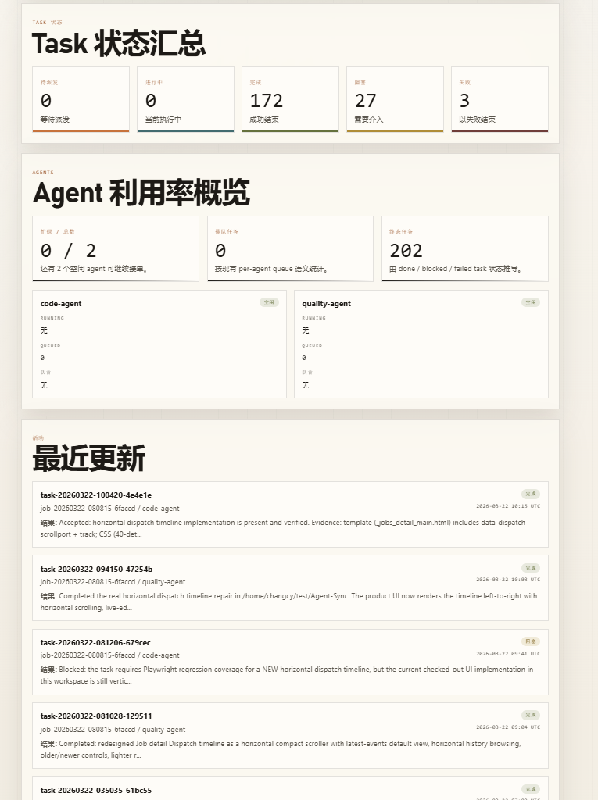
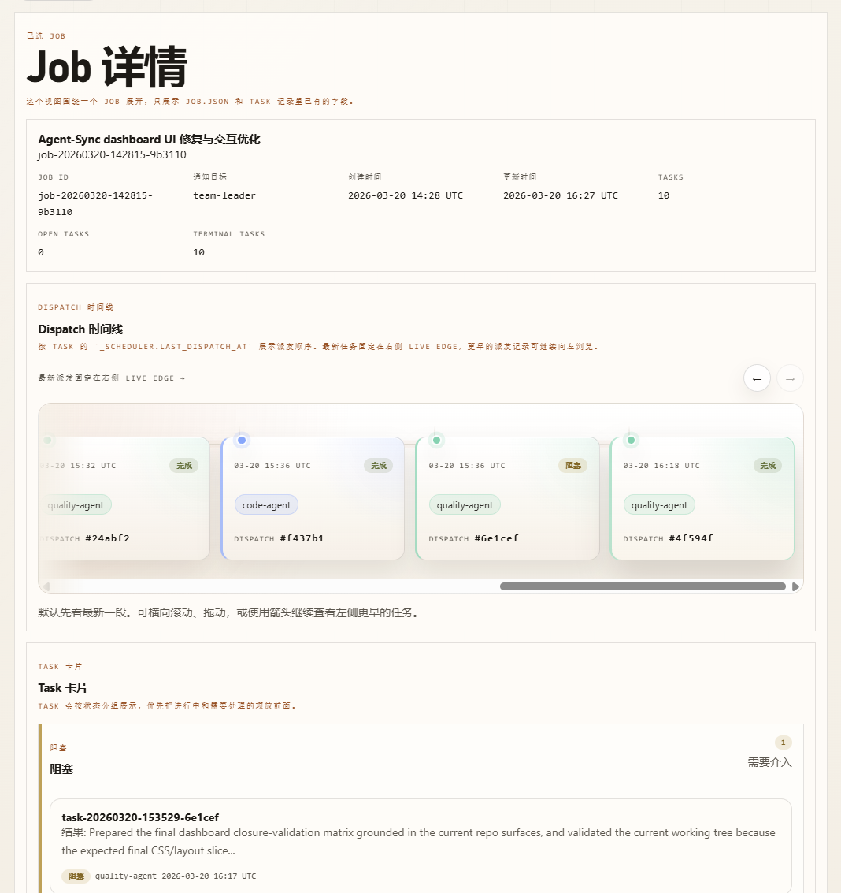
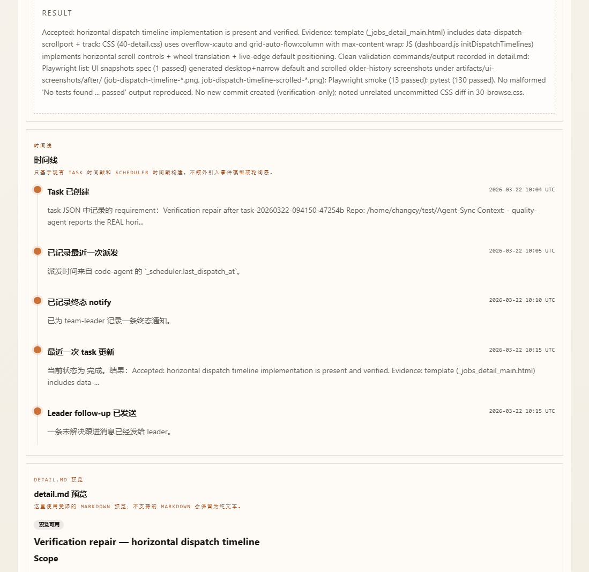
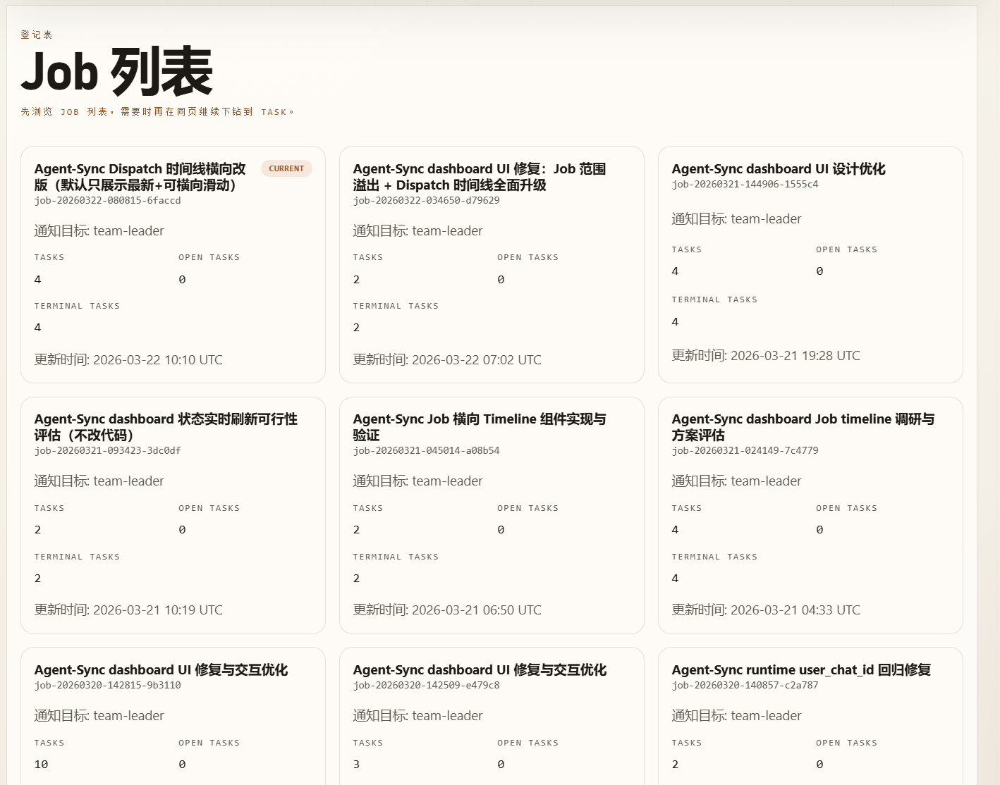

# 大聪明军团：OpenClaw 多 Agent 任务编排

> 构建真正能交付的 OpenClaw 多 Agent 开发团队，解决长期任务编排中的状态丢失、证据断裂与收口困难。

[中文](README.md) | [English](README.en.md)

`task-bridge` 是一个本地优先、专为 OpenClaw 多 Agent 协作设计的轻量级任务协作系统。它的核心使命是：让 OpenClaw 构建的多 Agent 协作团队，能够稳定地拆解任务、派发任务，并让各执行 Agent 直接把长流程开发工作闭环做完。

---

## Dashboard 预览（全局掌控）

只需一条命令，即可将本地的 Job、Tasks、Worker Queue、Alerts 和 Health 状态转化为可视化看板：

```bash
task-bridge dashboard
```

作为人类协作者或 Team Leader，你可以通过 Dashboard 实时监控团队运作。以下为总览页与 Job 详情页示例：

| Dashboard 总览 | Dashboard Job 详情 |
|---|---|
|  |  |
| **上帝视角**：查看任务状态分布、Agent 队列情况及系统健康度。 | **聚焦执行**：集中查看特定 Job 的派发时间线、任务拆解与当前卡点。 |

| Task 详情 | 跨语言支持 |
|---|---|
|  |  |
| **执行证据**：直接审查事件时间线、最新结果摘要，及随任务附带的 Markdown 执行细节。 | **全面掌控**：快速判断哪些 Job 正在推进、是否已收口。支持中英双语与本地字体切换。 |

---

## 为什么现有的方案行不通？

尝试使用 OpenClaw 组建 Agent 团队时，最核心的痛点往往不是缺少 Agent，而是 **Agent 极难稳定地把控长周期的开发任务**。

在构建 OpenClaw 多 Agent 工程团队时，业界通常会尝试以下两种主流方案。但在真实工程落地中，它们极易引发灾难性的工作流断裂：

### 1. 把“启动执行”误当成“完成执行”
- **做法**：Team Leader 拆解任务后，让某个 Agent 再去启动外部长会话或异步执行通道。
- **痛点分析**：在对接飞书等不支持长时间 Stream 的 IM 平台时，外部执行通道通常只能异步触发。这会引发严重的逻辑错位：Agent 刚发出启动指令，就立刻误以为自身工作结束，转头向 Leader 汇报“任务已完成”。这种将“任务启动”直接等同于“任务完成”的机制，会导致 Leader 过早进入验收或派发下一步任务，让多 Agent 工作流在起步阶段就彻底崩溃。

### 2. 让 Worker 只做转发而不拥有任务
- **做法**：Worker 收到任务后，不直接执行，而是把任务再交给另一层执行流程。
- **痛点分析**：真实工程中的需求开发，动辄需要几十分钟的深度上下文检索、代码生成与多轮纠错。如果 worker 只是转交任务而不负责状态回写，编排层就无法可靠知道任务是未开始、执行中、已完成还是失败。最终无人验证代码结果、无人回写终态、更无人通知 Leader，整个协作系统陷入“执行已完工，编排却永久停滞”的假死状态。

---

## Task Bridge 的解决方案

`task-bridge` 放弃了用“瞬时聊天状态”承载长程任务的做法，将其重构成一个极简的本地任务状态机：

- **本地落盘的事实源**：抛弃脆弱的聊天记录，所有的 Job、Task、State 全部以 JSON 格式落盘本地。
- **串行执行与异步转可控**：同一 Worker 同时只执行一个任务，强制持续回写执行记录，把异步动作转化为可追踪的稳定任务流。
- **Skill-first 的直接执行**：Worker 收到任务后先查看当前会话可用 skills；有匹配 skill 时优先使用该 skill 组织执行，没有匹配 skill 时再直接读仓库、跑命令并整理证据。
- **周期性防假死推进**：Daemon 守护进程会定期提醒 Worker 推进任务，防止执行挂起。
- **精准的终态通知与自动化 Follow-up**：仅在任务真正达到终态（done/blocked/failed）时主动唤醒 Leader，并对无人处理的终态任务自动催办，防止流水线停转。

---

## 完善的 Agent 团队阵容

引入了覆盖软件工程全生命周期的专业 Agent 团队。在 `task-bridge` 的编排下，团队职责分明：

- **Team Leader (协调者)**：面向用户做高层决策、建单、证据回收和最终收口，不直接承担设计、实现、测试或发布执行。
- **Planning Agent (规划者)**：负责需求澄清、方案收敛、sprint contract、验收口径与验证要求。
- **Code Agent (工程执行者)**：负责实现级设计、代码阅读、根因调查、实现、修复、重构、测试与提交。
- **Quality Agent (质量评估者)**：负责 plan evaluation、implementation evaluation、独立评审、QA、风险分级和必要的小范围修复。
- **Release Agent (交付执行者)**：负责发布准备、PR/部署/上线验证、回滚口径和文档同步。
- **Task Bridge (任务中枢)**：确定性的任务账本，负责存储状态、串行派发、终态通知。

### 运转机制

```text
User ──> [Team Leader] ──规划──> [Planning Agent] 
             │                          │
      (建立/拆解 Job & Tasks)            │
             │                          │
             ▼                          ▼
     ================ [Task Bridge Daemon] ================
     | (核心中枢：在后台监督队列，将任务分发给空闲 Worker)  |
     ======================================================
             │                          │
        (派发任务)                 (派发任务)
             ▼                          ▼
       [Code Agent]  <──协同──>  [Quality Agent] ──> [Release Agent]
        (实现与修复)             (测试与代码审查)        (文档与发布)
             │                          │
             └──────(回写进度与终态通知) ──┘
```

---

## 快速开始（人类视角）

对人类用户而言，你不需要手动敲击繁琐的命令行来管理任务。只需配置好环境并启动 Daemon，剩下的只需和 Team Leader 聊天即可。

### 1. 配置与安装

你需要将本仓库提供的 Agent Prompt 配置到 OpenClaw，并安装 `task-bridge` 到 Agent 环境。本项目只负责 agent 定义、任务编排、状态流转、证据回收和收口，不负责配置或验证底层执行环境：

```bash
# 在仓库根目录执行最小安装
python -m pip install -e .
```
*(注：若修改了 `pyproject.toml` 或入口，请重新执行此命令。)*

`planning-agent`、`code-agent`、`quality-agent`、`release-agent` 都被视为可直接执行任务的 Agent。Worker 收到 task 后先查看当前会话可用 skills；有匹配 skill 时优先使用该 skill，没有匹配 skill 时再直接阅读仓库、运行命令并整理证据。

**最佳实践：让 AI 帮你配置**
将文档提供给 OpenClaw 的 `default-agent` 或 Claude Code 代劳：
- 中文保姆级教程：`docs/zh/openclaw-agent-setup.md`
- English Setup Guide：`docs/en/openclaw-agent-setup.md`

### 2. 启动 Task Bridge Daemon (后台守护)

配置完成后，让任务中枢在后台运行：

```bash
task-bridge daemon --poll-seconds 10 --worker-reminder-seconds 900 --leader-reminder-seconds 3600
```

Daemon 会自动写入 `~/.openclaw/task-bridge/daemon.pid`、`daemon_heartbeat.json` 和 `daemon_errors.jsonl`。它还会持有本地 lock，避免同一个数据目录启动多个 daemon。

**参数说明：**
- `--poll-seconds 10`: 轮询队列间隔（默认 10 秒）。
- `--worker-reminder-seconds 900`: Worker 防挂起提醒间隔（默认 15 分钟）。超时未更新则提醒 Worker 推进。
- `--leader-reminder-seconds 3600`: Leader 长程任务关注提醒间隔（默认 60 分钟）。防止 Leader 失去对执行状态的感知。
- `--leader-followup 300`: 终态任务催办窗口（默认 5 分钟，`0` 表示禁用）。若收到终态后迟迟未下发新任务，主动合并成一条提醒催促 Leader。

查看后台状态：

```bash
task-bridge daemon-status --json
```

**持久化运行 (nohup)**:
```bash
mkdir -p .task-bridge
nohup task-bridge daemon \
  --poll-seconds 60 \
  --worker-reminder-seconds 2700 \
  --leader-reminder-seconds 7200 \
  --leader-followup 1800 \
  > .task-bridge/daemon.log 2>&1 &
```
*(停止时优先用 `task-bridge daemon-status --json` 查看真实 pid，再执行 `kill <pid>`。)*

### 3. 开启 Dashboard (只读，可选)

```bash
# 默认监听 127.0.0.1:8000
task-bridge dashboard

# 或指定监听地址与端口
task-bridge dashboard --host 127.0.0.1 --port 8000
```
*注：Dashboard 仅读取本地数据，不提供写操作，适合用于审计、定位卡点与日常检查。*

### 4. 给 Team Leader 下发需求

在你的 IM（如飞书）或终端中，直接对 **Team Leader** 对话：

> "我们需要开发一个包含用户认证的 Python CLI 工具，覆盖率要求 80%，让 Planning Agent 先出方案，然后安排 Code Agent 动工。"

接下来，Team Leader 会自动拆解任务，Daemon 会按队列向各路 Agent 派发任务，完成最终交付。

---

## 补充材料：CLI 工具箱 (面向 Agent / 调试)

> **注意**：以下命令主要供 Agent 在后台调用（如回写进度），人类平时无需执行，仅用于 Debug 或强制干预。

### 常用调试命令
```bash
# 查看队列与状态
task-bridge list-tasks --json
task-bridge worker-status --json
task-bridge queue code-agent --json
task-bridge daemon-status --json

# 单次派发测试 (不启动 Daemon 时)
task-bridge dispatch-once --json

# 历史终态任务补标，不向真实 agent 发送消息
task-bridge notify-backfill --mark-only --json
```

### 本地数据模型
任务结构清晰透明，方便人工随时审查 `~/.openclaw/task-bridge/`：
```text
current_job
daemon.pid              # 当前 daemon 进程信息；daemon 正常退出时自动清理
daemon_heartbeat.json   # 最近一轮 daemon 心跳、pid 和 phase_errors
daemon_errors.jsonl     # daemon phase 错误与 daemon_state 损坏记录
daemon_state.json       # reminder / notify / heartbeat 的持久状态
jobs/<job_id>/
  ├── job.json            # 完整工作主题
  ├── tasks/
  │   └── <task_id>.json  # 最小执行单元
  └── artifacts/
      └── <task_id>/
          └── detail.md   # (可选) 完整的执行细节。终态通知时将自动附带。
```

### 核心命令清单
| 类别 | 命令 | 说明 |
|------|------|------|
| **任务编排** | `create-job`, `list-jobs`, `show-job`, `use-job`, `current-job` | 管理宏观工作主题 (Leader 使用) |
| **任务管理** | `create-task`, `list-tasks`, `show-task`, `update-task`, `delete-task` | 管理具体执行步骤 |
| **Worker 状态** | `claim`, `start`, `update-result`, `complete`, `block`, `fail` | Worker 回写进度与终态 (各路 Agent 使用) |
| **Bridge 调度** | `worker-status`, `queue`, `dispatch-once`, `notify`, `notify-backfill`, `daemon`, `daemon-status` | 派发、通知补标、系统守护与后台健康检查 |

### 调度可靠性机制

- 派发前会检查 worker 是否已有 `running` task、是否还在等待 claim、是否处于 cooldown、是否已被真实派发失败阻断。
- 真实 `/reset` 或发送失败不会杀掉 daemon；Bridge 会记录 `last_dispatch_error`、递增 `dispatch_failure_count`，并按退避窗口稍后重试。
- 连续真实失败达到阈值后，task 会进入 `dispatch_blocked`，避免无限重启同一个 worker 会话。修改 queued task 的 `requirement` 或 `assigned_agent` 会清理这组失败字段。
- OpenClaw 进程预算满时会返回 `process_budget` 并进入短暂 deferred，不算真实失败，不会触发 `dispatch_blocked`，也不会在 `/reset` 前打断活跃会话。
- `notify_updates()` 默认只处理 current job，历史终态任务需要显式执行 `notify-backfill --mark-only` 或 `notify-backfill --summary`，避免旧任务批量打扰 `team-leader`。
- `TASK_BRIDGE_CAPTURE_FILE` 模式会绕过真实 OpenClaw 投递和进程预算检查，只把 `/reset`、dispatch、notify 消息写入 JSONL，适合安全 E2E 测试。

---

## 环境变量与进阶配置

系统会自动从当前工作目录 `.env` 或 `~/.openclaw/.env` 读取变量：
- `TASK_BRIDGE_USER_CHAT_ID`：注入通知 Prompt 的用户 `chat_id`（通知链路强依赖）。

以下变量需要通过 Shell 或前缀显式注入：
- `TASK_BRIDGE_HOME`：自定义数据目录（默认 `~/.openclaw/task-bridge`）。
- `TASK_BRIDGE_CAPTURE_FILE`：拦截发送动作并写入文件，适合做隔离的 E2E 测试。
- `TASK_BRIDGE_OPENCLAW_MAX_GLOBAL`：允许同时存在的全局 `openclaw agent` 进程数（默认 `2`，`0` 表示不限制）。
- `TASK_BRIDGE_OPENCLAW_MAX_PER_AGENT`：允许同一 agent 同时存在的 `openclaw agent` 进程数（默认 `1`，`0` 表示不限制）。
- `TASK_BRIDGE_OPENCLAW_RESET_TIMEOUT_SECONDS`：`/reset` 命令最大等待秒数（默认 `60`）。
- `TASK_BRIDGE_DASHBOARD_SSH_TARGET`：覆盖 dashboard 启动提示中的 SSH 目标地址，不影响实际监听。

---

## 参考指南

想要将这套工作流完美融入你的环境，请查阅：
- [OpenClaw Agent 配置指南 (中文)](docs/zh/openclaw-agent-setup.md)
- [OpenClaw Agent 工作流说明 (中文)](docs/zh/openclaw-agent-flow.md)
- [OpenClaw Agent Setup (English)](docs/en/openclaw-agent-setup.md)
- [OpenClaw Agent Workflow Guide (English)](docs/en/openclaw-agent-flow.md)

---

### 开发与测试指引

```bash
# 1. 源码运行 (不依赖 PATH)
PYTHONPATH=src python -m task_bridge create-job --title "Dev task"

# 2. 运行 Python 测试
python -m pip install -e .[test] pytest
python -m pytest -q

# 3. 运行 Dashboard Playwright 测试
npm install
npm run playwright:install
npm run test:playwright
```

> **Task Bridge 哲学**：它不是一个大而全的平台，而是一个极简的任务桥梁。它的核心价值在于让你的 Agent 团队不再失联，让 AI 协作真正落地跑通！至于具体 Prompt 如何设计、如何接入传统脚本 Worker，完全由你自由扩展。
